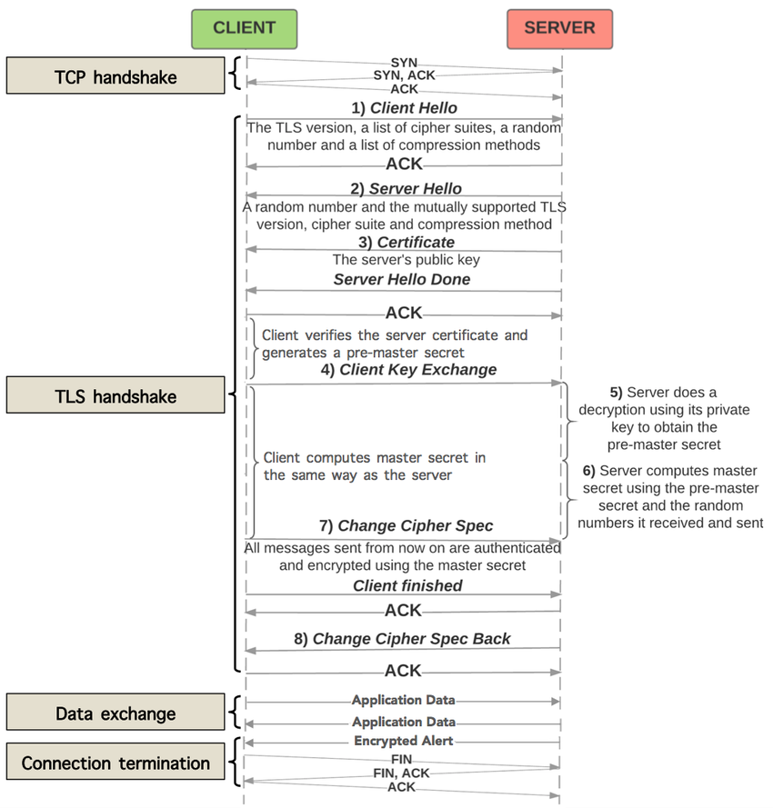
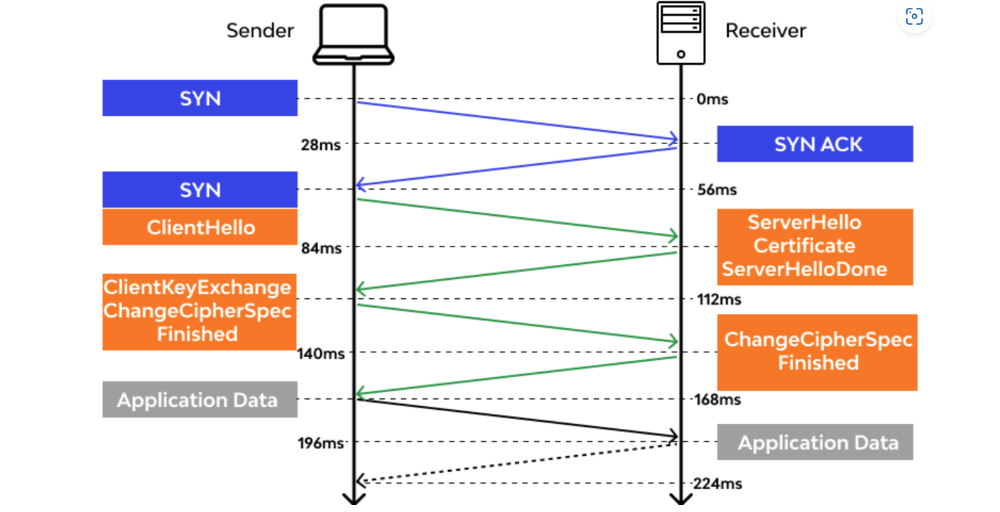
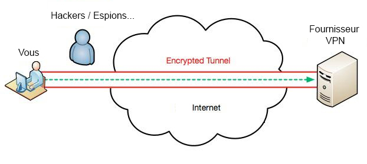

<!-- _class: lead -->
<!-- _paginate: false -->

# Connaître les techniques de hacking et les contre-mesures

---

## Sommaire


<div class="columns" style="font-size:30px">
<div>

#### Introduction au Hacking Éthique
   - **Concepts de base**
   - **Cadre juridique et éthique**
</div>

<div>

#### Techniques de Hacking
   - **Reconnaissance (Reconnaissance)**
   - **Scanning et énumération**
   - **Exploitation des vulnérabilités** 
   - **Maintien de l'accès**
   - **Escalade de privilèges**
   - **Couverture des traces**
</div>

--- 

## Sommaire


<div style="font-size:30px">

#### Contre-mesures
   - **Reconnaissance et détection**
   - **Renforcement des systèmes et des réseaux**
   - **Protection contre les exploits**
   - **Contrôle d'accès et gestion des privilèges**
   - **Cryptographie et sécurisation des communications**
   - **Plan de réponse aux incidents**
   - **Formation et sensibilisation des utilisateurs**
</div>

---


<!-- _class: lead -->
<!-- _paginate: false -->

## Introduction au Hacking Éthique

---

## Introduction au Hacking Éthique

**Concepts de base**

<div style="font-size:30px">

- Le **hacking éthique**, également appelé piratage éthique ou test d’intrusion, désigne la pratique consistant à pénétrer des systèmes informatiques, des réseaux ou des applications avec l'autorisation des propriétaires dans le but de découvrir des vulnérabilités que des hackers malveillants pourraient exploiter. 
- Cette pratique est effectuée par des professionnels qualifiés appelés hackers éthiques ou pentesteurs, qui utilisent les mêmes techniques et outils que les cybercriminels, mais de manière légale et constructive pour améliorer la sécurité des systèmes.

</div>

 
--- 

## Introduction au Hacking Éthique

**Concepts de base**
<br>
<div style="font-size:28px">

**Le hacking éthique est crucial pour renforcer la sécurité informatique. Il aide les organisations à :**

1. **Identifier et corriger les failles de sécurité** avant qu'elles ne soient exploitées.
2. **Évaluer l'efficacité des mesures de sécurité** en place, y compris les politiques de sécurité, l'accès aux points de contrôle, et les mécanismes de défense.
3. **Respecter les réglementations et normes de sécurité** qui requièrent des audits de sécurité réguliers, comme le GDPR, HIPAA, et PCI DSS.
4. **Sensibiliser et former** les équipes de sécurité et de développement sur les meilleures pratiques de sécurité et les dernières techniques de piratage.


</div>


---
## Introduction au Hacking Éthique

**Concepts de base**
<br>

<div style="font-size:28px">

La différence fondamentale entre le hacking éthique et le hacking malveillant réside dans l'intention, la permission et l'impact de l'activité sur les systèmes ciblés.

</div>

<div style="font-size:28px">

1. **Intention**:
   - **Hacking éthique** : L'intention est de renforcer la sécurité. Les hackers éthiques cherchent à identifier et à réparer les vulnérabilités pour prévenir des attaques malveillantes. Leur but est bénéfique et vise à améliorer la situation.
   - **Hacking malveillant** : L'intention est de causer du tort, d'exploiter les failles à des fins personnelles ou criminelles, comme le vol de données, la perturbation des services, ou le gain financier.


</div>

---
## Introduction au Hacking Éthique

**Concepts de base**


<div style="font-size:30px">

2. **Permission**:
   - **Hacking éthique** : Il est toujours réalisé avec la permission explicite des propriétaires des systèmes informatiques. Cette permission est souvent formalisée par un contrat ou un accord légal définissant le cadre de l'action.
   - **Hacking malveillant** : Il est effectué sans consentement, violant ainsi les lois et les politiques de confidentialité. Cela constitue une intrusion illégale dans les systèmes d'autrui.
</div>

---

## Introduction au Hacking Éthique

**Concepts de base**
<br>


<div style="font-size:26px">

3. **Méthodologie**:
   - **Hacking éthique** : Les méthodes utilisées sont structurées et documentées. Les hackers éthiques suivent des lignes directrices éthiques strictes et s'assurent que leur travail est transparent et réversible. Ils rapportent toutes les vulnérabilités trouvées aux propriétaires et conseillent souvent sur les moyens de les réparer.
   - 
   - **Hacking malveillant** : Les techniques peuvent être destructrices et visent souvent à masquer les traces de l'intrusion. Les hackers malveillants utilisent leurs compétences pour exploiter les failles sans en informer les victimes, et souvent en laissant des backdoors pour faciliter l'accès futur.


</div>

---
## Introduction au Hacking Éthique

**Concepts de base**
<br>

<div style="font-size:29px">

4. **Impact**:
   - **Hacking éthique** : L'impact est positif, car il conduit à une meilleure sécurité et à une plus grande sensibilisation aux vulnérabilités et aux risques de sécurité.
   - 
   - **Hacking malveillant** : L'impact est négatif, entraînant des pertes financières, des dommages à la réputation, la perte de données sensibles, et d'autres conséquences dommageables pour les victimes.

</div>

---

## Introduction au Hacking Éthique

**Cadre juridique et éthique**
<br>

<div style="font-size:35px">

La législation relative à la sécurité informatique varie considérablement d'un pays à l'autre, mais elle couvre généralement plusieurs aspects fondamentaux pour protéger les données et les systèmes informatiques contre les menaces de sécurité.

</div>

---
## Introduction au Hacking Éthique

**Cadre juridique et éthique**
<br>

<div style="font-size:28px">

### 1. **Union européenne (UE) - Règlement général sur la protection des données (RGPD)**
   - **Objectif** : Protéger les données personnelles des citoyens de l'UE.
   - **Implications** : Impose des exigences strictes sur la collecte, le stockage et la gestion des données personnelles, y compris la nécessité d'obtenir un consentement explicite, le droit à l'oubli, et des notifications obligatoires en cas de violation de données.


</div>

---
## Introduction au Hacking Éthique

**Cadre juridique et éthique**
<br>
<div style="font-size:30px">

#### 2. **États-Unis - Health Insurance Portability and Accountability Act (HIPAA)**

   - **Objectif** : Protéger les informations médicales privées.
   - **Implications** : Définit comment les informations de santé personnelles doivent être protégées, y compris des exigences pour les mesures de sécurité physiques, administratives et techniques.

</div>

---

## Introduction au Hacking Éthique

**Cadre juridique et éthique**
<br>
<div style="font-size:28px">


### 3. **États-Unis et UE - Privacy Shield Framework**
   - **Objectif** : Faciliter le transfert transatlantique de données personnelles entre l'UE et les États-Unis dans le respect de la protection de la vie privée.
   - **Implications** : Fournit un mécanisme pour les entreprises américaines pour se conformer aux exigences de protection des données de l'UE.

</div>

---

## Introduction au Hacking Éthique

**Cadre juridique et éthique**
<br>
<div style="font-size:28px">


### 4. **États-Unis - Children’s Online Privacy Protection Act (COPPA)**
   - **Objectif** : Protéger les enfants de moins de 13 ans lorsqu'ils utilisent des services en ligne.
   - **Implications** : Exige que les sites web et services en ligne dirigés vers les enfants obtiennent le consentement parental avant de collecter des informations personnelles des enfants.

</div>

---

## Introduction au Hacking Éthique

**Cadre juridique et éthique**
<br>
<div style="font-size:28px">


### 5. **International - Payment Card Industry Data Security Standard (PCI DSS)**
   - **Objectif** : Protéger les données des titulaires de cartes de crédit.
   - **Implications** : Établit des normes de sécurité opérationnelle pour tous les membres, marchands et prestataires de services qui stockent, traitent ou transmettent des informations de titulaire de carte.


</div>

---


## Introduction au Hacking Éthique

**Rôle et responsabilité des hackers éthiques**
<br>
<div style="font-size:34px">


- Les hackers éthiques jouent un rôle crucial dans la protection des systèmes informatiques contre les attaques malveillantes. 
- Leur travail consiste à tester de manière proactive la sécurité des systèmes pour identifier et corriger les vulnérabilités avant qu'elles ne soient exploitées par des acteurs malveillants.


</div>

---

## Introduction au Hacking Éthique

**Rôles des hackers éthiques**
<br>
<div style="font-size:19px">

1. **Évaluation de la sécurité** : Réaliser des tests d'intrusion et des audits de sécurité pour évaluer la robustesse des systèmes, des réseaux, des applications web et mobiles contre les tentatives d'intrusion.

2. **Identification des vulnérabilités** : Utiliser des méthodes et outils avancés pour découvrir les failles de sécurité dans les infrastructures informatiques, y compris les failles logicielles, les configurations erronées, et les pratiques inadéquates de gestion des données.

3. **Rapport détaillé** : Fournir des rapports détaillés sur les vulnérabilités détectées, leur niveau de risque, et les méthodes d'exploitation potentielles. Ceux-ci incluent également des recommandations pratiques pour sécuriser les systèmes.

4. **Validation des correctifs** : Après que les vulnérabilités identifiées ont été corrigées par les équipes de TI, réaliser une nouvelle série de tests pour s'assurer que les correctifs sont efficaces et ne créent pas de nouvelles failles.

5. **Formation et sensibilisation** : Éduquer les développeurs, le personnel TI et les utilisateurs finaux sur les meilleures pratiques de sécurité, les nouvelles menaces et comment se protéger contre les attaques.

</div>

---

## Introduction au Hacking Éthique

**Responsabilités des hackers éthique**
<br>
<div style="font-size:20px">

1. **Confidentialité** : Maintenir la confidentialité des informations découvertes lors des tests. Les hackers éthiques ne doivent pas divulguer ou utiliser ces informations à des fins personnelles ou non autorisées.

2. **Intégrité** : Agir avec intégrité en évitant d'endommager les systèmes cibles ou de perturber leurs opérations normales lors des tests.

3. **Légalité** : Opérer toujours dans les limites de la loi, avec la permission explicite des propriétaires des systèmes. Ils doivent suivre un cadre légal strict pour éviter les implications juridiques pour eux-mêmes et pour les organisations pour lesquelles ils travaillent.

4. **Rapport responsable** : S'assurer que les vulnérabilités sont rapportées aux bonnes parties prenantes de manière sécurisée pour éviter toute fuite d'informations qui pourrait bénéficier à des hackers malveillants.

5. **Mise à jour continue** : Restez à jour avec les dernières tendances en matière de cybersécurité, les techniques de hacking et les technologies de défense pour rester efficaces dans leur rôle.

</div>

---


<!-- _class: lead -->
<!-- _paginate: false -->

##  Techniques de Hacking


---

## Techniques de Hacking
#### Reconnaissance
<br>

<div style="font-size:27px">

- OSINT, ou Open Source Intelligence, désigne la collecte et l'analyse de données disponibles publiquement à partir de sources ouvertes pour obtenir des informations exploitables. 
- Les sources ouvertes peuvent inclure tout ce qui est légalement accessible par le public, comme des publications en ligne, des réseaux sociaux, des forums, des blogs, des bases de données publiques, des documents gouvernementaux, et bien plus encore.

</div>

---
## Techniques de Hacking
#### Reconnaissance

<center>

</center>

---


## Techniques de Hacking
#### Reconnaissance

<div style="font-size:27px">
<br>
L'Open Source Intelligence (OSINT) désigne la collecte et l'analyse d'informations disponibles publiquement à partir de sources ouvertes.
</div>

<div style="font-size:25px">

### 1. Recherche sur Internet
- **Moteurs de recherche :** Utilisation de moteurs de recherche comme Google, Bing, ou DuckDuckGo pour trouver des informations.
- **Opérateurs de recherche avancée :** Utilisation d'opérateurs comme site:, filetype:, intext:, intitle:, etc. pour affiner les recherches.
- **Wayback Machine :** Utilisation de l'Internet Archive pour accéder aux versions archivées de pages web.

</div>

---
## Techniques de Hacking
#### Reconnaissance


<div style="font-size:30px">

### 2. Réseaux sociaux
- **Profilage :** Analyse des profils et des publications sur des plateformes comme Facebook, Twitter, LinkedIn, Instagram.
- **Graph Search :** Utilisation de fonctionnalités de recherche avancée pour découvrir les relations et les connexions entre les utilisateurs.
- **Sentiment Analysis :** Analyse des sentiments des publications pour obtenir des informations sur les opinions et les attitudes.

</div>

---

## Techniques de Hacking
#### Reconnaissance

<div style="font-size:30px">

### 3. Bases de données et registres publics
- **Whois :** Consultation des informations de registre de domaine.
- **Registres d'entreprises :** Accès aux informations sur les entreprises via des registres comme Infogreffe, Companies House, etc.
- **Documents gouvernementaux :** Recherches dans les bases de données gouvernementales, les archives judiciaires, les rapports financiers, etc.

</div>

---

## Techniques de Hacking
#### Reconnaissance

<div style="font-size:30px">

### 4. Forums et communautés en ligne
- **Recherche dans les forums :** Participation et surveillance des discussions sur des forums spécialisés comme Reddit, 4chan, etc.
- **Newsgroups :** Utilisation de groupes de discussion comme Google Groups pour trouver des informations spécialisées.

</div>

---

## Techniques de Hacking
#### Reconnaissance

<div style="font-size:24px">

### 5. Médias traditionnels et électroniques
- **Articles de presse :** Lecture et analyse d'articles de journaux, de magazines, et de sites d'information.
- **Communiqués de presse :** Surveillance des communiqués de presse pour des informations officielles.

### 6. Analyse de documents
- **Metadata :** Extraction et analyse des métadonnées des documents pour obtenir des informations supplémentaires.
- **OCR (Optical Character Recognition) :** Utilisation de la reconnaissance optique de caractères pour extraire du texte à partir d'images ou de PDF scannés.

</div>

---
## Techniques de Hacking
#### Reconnaissance

<div style="font-size:24px">

### 7. Surveillance des réseaux
- **Analyse de trafic :** Surveillance et analyse du trafic réseau pour détecter des informations sensibles.
- **Sniffing :** Utilisation d'outils de sniffing pour capturer et analyser les paquets de données sur un réseau.

### 8. Techniques de géolocalisation
- **Analyse de photos :** Utilisation des métadonnées des photos (EXIF) pour obtenir des informations sur l'emplacement et l'heure de la prise de vue.
- **Google Earth/Maps :** Utilisation des outils de cartographie pour analyser des emplacements et des infrastructures.

</div>


---

## Techniques de Hacking
#### Reconnaissance

<div style="font-size:24px">

### 9. Scraping et automatisation
- **Web scraping :** Utilisation d'outils et de scripts pour extraire des informations de sites web de manière automatisée.
- **Bots :** Développement de bots pour automatiser la collecte d'informations sur différentes plateformes.

### 10. Analyse des relations
- **Graphes de liens :** Utilisation de logiciels pour créer des graphes de liens entre des entités (personnes, entreprises, événements) pour visualiser et analyser les relations.

</div>

---

## Fondamentaux de la sécurité informatique
#### Principales menaces et vulnérabilités
<br>


<div style="font-size:30px">

**Attaques importantes recentes**

</div>

<div style="font-size:23px">

<br>

- **NOTPETYA** -> Attaque du 27 Juin 2017

<br>

- **WANNACRY** -> Attaques des 12 et 13 mai 2017

<br>

- **SONY** -> Attaque de Novembre 2014


</div>


---

## Fondamentaux de la sécurité informatique
#### Principales menaces et vulnérabilités
<br>


<div style="font-size:27px">

**Statistiques des attaques**

</div>

<div style="font-size:24px">

<br>

***Concernant les particuliers***

- Source https://silicon.fr
- 3 minutes en moyenne pour pirater un nouvel objet connecté
- 1,1 million de victimes de fraude à la carte bancaire par an
- 83% des smartphones infectés au 2eme semestre 2016
- 65 vols de données par seconde
- 41% de succès lors d’attaque par RansomWare
- 201 jours en moyenne pour découvrir une cyberattaque


</div>


---


## Fondamentaux de la sécurité informatique
#### Principales menaces et vulnérabilités
<br>


<div style="font-size:27px">

**Statistiques des attaques**

</div>

<div style="font-size:23px">

<br>

***Concernant les entreprises***
- 77% des organisations mondiales ont été victimes d’au moins une cyberattaque réussie en 2017
- https://cyber-edge.com/wp-content/uploads/2018/03/CyberEdge2018-CDR.pdf
- 23% des entreprises de type PME ont eu un incident de sécurité à cause d’objets connectés (IoT)
- https://keepersecurity.com/fr_FR2017-State-Cybersecurity-SmallMedium-Businesses-SMB.html
- 95% des attaques web comportent de l’ingénierie sociale
- https://www.proofpoint.com/sites/default/files/pfpt-fr-tr-thehuman-factor-2018.pdf


</div>


---

## Fondamentaux de la sécurité informatique
#### Principales menaces et vulnérabilités
<br>


<div style="font-size:27px">

**Statistiques des attaques**

</div>

<div style="font-size:22px">

<br>

***Concernant les entreprises***

- 5 à 10% du budget d’une entreprise est consacré à la cybersécurité
- https://experiences.microsoft.fr/business/confiance-numeriquebusiness cybersecurite-chiffres-cles/
- 800 000€ de coût en moyenne lors d’une violation de sécurité
- https://experiences.microsoft.fr/business/confiance-numeriquebusinesscybersecurite-chiffres-cles/
- 35% des incidents de cybersécurité sont dus à des collaborateurs
- https://experiences.microsoft.fr/business/confiance-numeriquebusiness/cybersecurite-chiffres-cles/


</div>


---

## Fondamentaux de la sécurité informatique
#### Principales menaces et vulnérabilités
<br>


<div style="font-size:27px">

**Autres sources**

</div>

<div style="font-size:27px">

<br>

- https://experiences.microsoft.fr/articles/cybersecurite/cybersecurite-chiffres-cles/


- https://cyberedgegroup.com/cdr/

</div>

---

## Fondamentaux de la sécurité informatique
#### Principales menaces et vulnérabilités
<br>


<div style="font-size:27px">

**Mesures de Protection**

</div>

<div style="font-size:20px">

<br>

- **Mises à jour régulières et correctifs de sécurité** : Maintenir tous les logiciels et systèmes à jour.
- **Politiques de mot de passe robustes** : Exiger des mots de passe complexes et utiliser l'authentification multi-facteurs.
- **Configuration sécurisée** : S'assurer que les systèmes sont correctement configurés et sécurisés.
- **Sécurité physique** : Protéger les équipements et les données par des contrôles d'accès physiques.
- **Formation des employés** : Former et sensibiliser régulièrement les employés aux menaces de sécurité.
- **Chiffrement des données** : Utiliser des techniques de chiffrement pour protéger les données sensibles.
- **Contrôles d'accès** : Implémenter des contrôles d'accès stricts basés sur les rôles et les besoins.
- **Surveillance et journalisation** : Mettre en place des systèmes de surveillance et de journalisation pour détecter et répondre aux incidents de sécurité.

</div>

---

## Fondamentaux de la sécurité informatique
#### Concepts de base en sécurité
<br>

<div style="font-size:27px">

**Confidentialité, intégrité et disponibilité (CIA)**

</div>

<br>

<div style="font-size:26px">

- Le modèle de sécurité CIA (Confidentialité, Intégrité et Disponibilité) est un cadre fondamental utilisé pour guider les politiques de sécurité de l'information au sein d'une organisation. 
- Chacun de ces trois piliers vise à protéger différents aspects des informations et des systèmes informatiques.

</div>

---
## Fondamentaux de la sécurité informatique
#### Concepts de base en sécurité


<div style="font-size:25px">

1. ***Confidentialité (Confidentiality)***

</div>

<div style="font-size:18px">

- **Définition :** La confidentialité consiste à garantir que les informations ne sont accessibles qu'aux personnes autorisées et à prévenir tout accès non autorisé.

- **Objectif :**
   - Protéger les données sensibles contre les intrusions, le vol et la divulgation non autorisée.
   - Assurer que seules les personnes ayant les droits nécessaires peuvent consulter ou manipuler les informations.

- **Mécanismes de protection :**

   - **Chiffrement :** Utilisation de techniques de cryptographie pour rendre les données illisibles pour les utilisateurs non autorisés.
   - **Contrôle d'accès :** Mise en œuvre de systèmes d'authentification et d'autorisation pour vérifier les identités et limiter l'accès aux informations sensibles.
   - **Politiques de confidentialité :** Établir des règles strictes sur qui peut accéder aux informations et sous quelles conditions.

</div>

---

## Fondamentaux de la sécurité informatique
#### Concepts de base en sécurité

<div style="font-size:25px">

2. ***Intégrité (Integrity)***

</div>

<div style="font-size:18px">

- **Définition :** L'intégrité vise à maintenir la précision et la complétude des données tout au long de leur cycle de vie.

- **Objectif :**
   - Empêcher la modification non autorisée ou non détectée des données.
   - Garantir que les informations sont fiables et exactes.

- **Mécanismes de protection :**

   - **Contrôles de version :** Suivre les modifications apportées aux données et permettre la restauration des versions antérieures en cas de besoin.
   - **Sommes de contrôle et hachage :** Utiliser des fonctions de hachage pour vérifier que les données n'ont pas été altérées.
   - **Journalisation et audits :** Enregistrer les modifications et les accès aux données pour pouvoir détecter et analyser les actions suspectes.

</div>

---

## Fondamentaux de la sécurité informatique
#### Concepts de base en sécurité

<div style="font-size:25px">

3. ***Disponibilité (Availability)***

</div>

<div style="font-size:18px">

- **Définition :** La disponibilité garantit que les systèmes, les services et les données sont accessibles en temps voulu par les utilisateurs autorisés.

- **Objectif :**
   - Assurer un accès continu aux informations et aux systèmes nécessaires aux opérations.
   - Minimiser les temps d'arrêt et les interruptions de service.

- **Mécanismes de protection :**

   - **Redondance :** Utiliser des systèmes et des chemins de communication redondants pour éviter les points de défaillance uniques.
   - **Plans de reprise après sinistre (DRP) :** Établir des procédures pour restaurer les systèmes et les données après un incident.
   - **Maintenance régulière et surveillance :** Effectuer des vérifications et des maintenances préventives pour détecter et corriger les problèmes avant qu'ils n'affectent la disponibilité.

</div>

---
## Fondamentaux de la sécurité informatique
#### Concepts de base en sécurité

<div style="font-size:25px">

<br>

***Importance du Modèle CIA***

</div>

<br>

<div style="font-size:23px">

Le modèle CIA est essentiel car il offre une approche équilibrée pour sécuriser les systèmes d'information. 

<br>

- **Confidentialité :** Empêche les fuites d'informations et protège la vie privée.
- **Intégrité :** Assure que les informations sont exactes et fiables, évitant les erreurs et les fraudes.
- **Disponibilité :** Garantit que les services et les informations sont disponibles lorsque nécessaire, supportant la continuité des activités.

</div>


---

## Fondamentaux de la sécurité informatique
#### Concepts de base en sécurité
<br>

<div style="font-size:27px">

**Authentification, Autorisation et Audit (AAA)**

</div>

<br>

<div style="font-size:26px">

- Le modèle AAA, qui se compose de l'Authentification, de l'Autorisation et de l'Audit, est un cadre fondamental utilisé pour gérer et renforcer la sécurité des systèmes d'information et des réseaux. 
- Chacun de ces trois composants joue un rôle crucial dans la protection des ressources informatiques et la garantie de leur utilisation appropriée.

</div>

---

## Fondamentaux de la sécurité informatique
#### Concepts de base en sécurité

<div style="font-size:25px">

1. ***Authentification (Authentication)***

</div>

<div style="font-size:18px">

- **Définition :** L'authentification est le processus de vérification de l'identité d'un utilisateur, d'un système ou d'un service.

- **Objectif :**
   - Garantir que seules les entités légitimes peuvent accéder aux systèmes et aux données.
   - Prévenir l'accès non autorisé en vérifiant l'identité des utilisateurs ou des systèmes.

- **Mécanismes de protection :**

   - **Mots de passe :** Utilisation de mots de passe forts et uniques pour authentifier les utilisateurs.
   - **Biométrie :** Utilisation de caractéristiques physiques (empreintes digitales, reconnaissance faciale) pour l'authentification.
   - **Cartes à puce et tokens :** Dispositifs matériels utilisés pour authentifier les utilisateurs.
   - **Authentification multi-facteurs (MFA) :** Combinaison de plusieurs méthodes d'authentification (par exemple, mot de passe + token).

</div>

---


## Fondamentaux de la sécurité informatique
#### Concepts de base en sécurité

<div style="font-size:25px">

2. ***Autorisation (Authorization)***

</div>

<div style="font-size:18px">

- **Définition :** L'autorisation est le processus de détermination des ressources et des services auxquels un utilisateur, un système ou un service authentifié a accès.

- **Objectif :**
   - Assurer que les utilisateurs ont accès uniquement aux ressources nécessaires pour accomplir leurs tâches.
   - Prévenir l'accès non autorisé aux ressources sensibles.

- **Mécanismes de protection :**

   - **Contrôle d'accès basé sur les rôles (RBAC) :** Attribution des permissions en fonction des rôles des utilisateurs dans l'organisation.
   - **Listes de contrôle d'accès (ACL) :** Définition des permissions spécifiques pour les utilisateurs ou les groupes d'utilisateurs.
   - **Cartes à puce et tokens :** Dispositifs matériels utilisés pour authentifier les utilisateurs.
   - **Politiques de sécurité :** Établissement de règles claires concernant l'accès aux ressources.

</div>

---

## Fondamentaux de la sécurité informatique
#### Concepts de base en sécurité

<div style="font-size:25px">

2. ***Audit (Accounting)***

</div>

<div style="font-size:18px">

- **Définition :**  L'audit, ou l'accounting, est le processus de suivi et d'enregistrement des actions et des accès des utilisateurs, des systèmes et des services.

- **Objectif :**
   - Fournir une traçabilité des actions pour l'analyse des incidents de sécurité et la conformité réglementaire.
   - Permettre la détection et l'analyse des comportements suspects ou des violations de sécurité.

- **Mécanismes de protection :**

   - **Journaux d'audit (log files) :** Enregistrement détaillé des accès, des actions et des modifications apportées aux systèmes et aux données.
   - **Systèmes de gestion des informations et des événements de sécurité (SIEM) :** Collecte et analyse centralisée des journaux d'audit pour détecter les incidents de sécurité.
   - **Rapports et alertes :** Génération de rapports réguliers et envoi d'alertes en cas d'activités suspectes.

</div>

---
## Fondamentaux de la sécurité informatique
#### Concepts de base en sécurité

<div style="font-size:25px">

<br>

***Importance du Modèle AAA***

</div>

<br>

<div style="font-size:23px">

Le modèle **AAA** est essentiel pour la gestion de la sécurité des systèmes d'information et des réseaux.

<br>

- **Authentification :** Empêche l'accès non autorisé en vérifiant l'identité des utilisateurs, ce qui est la première ligne de défense contre les intrusions.
- **Autorisation :** Assure que les utilisateurs authentifiés n'ont accès qu'aux ressources nécessaires, minimisant le risque d'abus ou de compromission des données sensibles.
- **Audit :** Fournit une traçabilité complète des actions et des accès, facilitant la détection des comportements anormaux, l'analyse des incidents et la conformité réglementaire.

</div>

---


<!-- _class: lead -->
<!-- _paginate: false -->

## Sécurité des systèmes d'exploitation

---


## Sécurité des systèmes d'exploitation

#### La Définition ?

<br>

<div style="font-size:35px">

La sécurité des systèmes d'exploitation (OS) fait référence à un ensemble de pratiques, de mesures et de technologies visant à protéger les systèmes d'exploitation contre les menaces potentielles, telles que les accès non autorisés, les attaques de logiciels malveillants, les vulnérabilités de sécurité et les erreurs de configuration.

</div>

---

## Sécurité des systèmes d'exploitation

#### Les aspects essentiels

<br>

<div style="font-size:30px">

<div class="columns">

<div>

- Authentification et autorisation 

- Protection contre les logiciels malveillants 

- Mises à jour de sécurité 

- Chiffrement des données

- Surveillance et journalisation

</div>

<div>

- Gestion des vulnérabilités 

- Sécurisation des configurations 

- Sécurisation des réseaux

- Éducation et sensibilisation

</div>


</div>

---

## Sécurité des systèmes d'exploitation

#### Mises à jour régulières

<br>

<div style="font-size:23px">

1. **Utilisation de gestionnaires de paquets :**
   - Sur les distributions comme Ubuntu, utilisez `apt` pour mettre à jour les paquets système :
     ```bash
     sudo apt update
     sudo apt upgrade
     ```
   - Sur les distributions comme CentOS/RHEL, utilisez `yum` ou `dnf` :
     ```bash
     sudo yum update
     ```
     ou

     ```bash
     sudo dnf update
     ```

---
## Sécurité des systèmes d'exploitation

#### Mises à jour régulières

<br>

<div style="font-size:25px">


2. **Configurer les mises à jour automatiques :**
   - Vous pouvez configurer votre système pour qu'il vérifie et installe automatiquement les mises à jour de sécurité. Par exemple, sur Ubuntu, vous pouvez utiliser `unattended-upgrades`.

3. **Vérifier régulièrement les mises à jour :**
   - Planifiez un horaire régulier pour vérifier les mises à jour disponibles et les appliquer. Par exemple, configurez une tâche cron pour exécuter `apt update` et `apt upgrade` toutes les semaines.

--- 
## Sécurité des systèmes d'exploitation

#### Mises à jour régulières


<div style="font-size:23px">

4. **Mises à jour des applications tierces :**
   - Si vous utilisez des logiciels tiers ou des applications non incluses dans les dépôts officiels de votre distribution, assurez-vous de suivre les instructions de mise à jour fournies par les développeurs de ces applications.

5. **Surveillance des annonces de sécurité :**
   - Abonnez-vous aux listes de diffusion de sécurité de votre distribution Linux pour être informé des nouvelles vulnérabilités et des correctifs disponibles.

6. **Utilisation de gestionnaires de version pour les environnements de développement :**
   - Si vous développez ou utilisez des applications basées sur des environnements comme Python, Node.js, etc., utilisez des gestionnaires de version comme `pip` ou `npm` pour gérer les mises à jour des bibliothèques et des dépendances.

---

## Sécurité des systèmes d'exploitation
#### Utilisation de comptes avec privilèges minimaux
<br>
    
<div>

Les principes de moindre privilège sont des principes de sécurité informatique visant à limiter les droits et les privilèges des utilisateurs, des applications et des processus au niveau minimum nécessaire pour accomplir leurs tâches spécifiques.


</div>
    
---
## Sécurité des systèmes d'exploitation
#### Utilisation de comptes avec privilèges minimaux
<br>
    
<div style="font-size:25px">

1. **Privilèges administratifs restreints :**

- Limitez l'accès administratif aux seules personnes et aux seules ressources nécessaires pour effectuer des tâches administratives spécifiques. Évitez de donner des droits d'administration complets à des utilisateurs qui n'en ont pas besoin.
  
2. **Contrôle d'accès basé sur le rôle (RBAC) :**

- Utilisez le RBAC pour attribuer des droits d'accès en fonction des rôles spécifiques des utilisateurs dans l'organisation. Cela garantit que chaque utilisateur a uniquement les permissions nécessaires pour accomplir ses responsabilités.


</div>

---
## Sécurité des systèmes d'exploitation
#### Utilisation de comptes avec privilèges minimaux
<br>
    
<div style="font-size:27px">

3. **Principe du besoin de savoir :**

- Appliquez ce principe en limitant l'accès à l'information uniquement aux personnes qui ont besoin de connaître cette information pour effectuer leur travail.


4. **Examen des privilèges :**

- Passez régulièrement en revue les privilèges accordés aux utilisateurs et aux applications pour vous assurer qu'ils restent pertinents et nécessaires.


</div>

---

## Sécurité des systèmes d'exploitation
#### Utilisation de comptes avec privilèges minimaux
<br>
    
<div style="font-size:27px">

5. **Privilèges par défaut :**

- Configurez les systèmes et les applications avec les privilèges par défaut les plus bas possibles, puis accordez des privilèges supplémentaires au cas par cas, si nécessaire.
  
6. **Surveillance et audit :**

- Surveillez l'utilisation des privilèges et auditez régulièrement les activités des utilisateurs et des applications pour détecter toute anomalie ou utilisation abusive.


</div>

---

## Sécurité des systèmes d'exploitation
#### Utilisation de comptes avec privilèges minimaux
<br>
    
<center>

</center>
    
---
## Sécurité des systèmes d'exploitation
#### Contrôle des accès

<br>

- Les modèles de contrôle d'accès sont essentiels pour gérer et restreindre l'accès aux ressources d'un système informatique. 
- Les principaux modèles de contrôle d'accès : Discretionary Access Control (DAC), Mandatory Access Control (MAC) et Role-Based Access Control (RBAC).

---

## Sécurité des systèmes d'exploitation
#### Contrôle des accès


<div style="font-size:23px">

### 1. Discretionary Access Control (DAC)
<br>

**Définition**:
Le modèle de contrôle d'accès discrétionnaire (DAC) est un modèle où les propriétaires de ressources ou d'objets ont le pouvoir de décider qui peut accéder à leurs ressources et avec quels privilèges.
<br>

**Caractéristiques**:
- **Flexibilité** : Les utilisateurs ont la liberté de partager leurs ressources avec d'autres.
- **Contrôle par l'utilisateur** : Le contrôle d'accès est basé sur les identités des utilisateurs et les permissions définies par les propriétaires des ressources.
- **Permissions basées sur les fichiers** : Les permissions sont souvent gérées par les propriétaires des fichiers et des répertoires.

</div>

---

## Sécurité des systèmes d'exploitation
#### Contrôle des accès

<br>

<div style="font-size:30px">

**Exemple**:

Environnement UNIX/Linux où les propriétaires de fichiers peuvent définir les permissions d'accès pour leurs fichiers en utilisant des commandes comme `chmod`.

```bash
chmod 755 fichier.txt
```

</div>

---

## Sécurité des systèmes d'exploitation
#### Contrôle des accès

<div style="font-size:22px">

### 2. Mandatory Access Control (MAC)
<br>

**Définition**:

Le modèle de contrôle d'accès obligatoire (MAC) est un modèle où l'accès aux ressources est contrôlé par des politiques de sécurité centralisées définies par l'administration système et non par les propriétaires des ressources.

<br>

**Caractéristiques**:
- **Centralisation** : Les décisions d'accès sont prises par un administrateur central et non par les utilisateurs individuels.
- **Labels de sécurité** : Les objets (fichiers, données) et sujets (utilisateurs, processus) sont assignés des labels de sécurité.
- **Politiques strictes** : Les politiques de sécurité sont strictes et non modifiables par les utilisateurs.

</div>

---

## Sécurité des systèmes d'exploitation
#### Contrôle des accès

<br>

<div style="font-size:30px">

**Exemple**:
SElinux (Security-Enhanced Linux) est un exemple de mise en œuvre de MAC où les politiques de sécurité sont définies par l'administrateur et appliquées strictement.

```bash
sestatus
```

</div>

---

## Sécurité des systèmes d'exploitation
#### Contrôle des accès

<div style="font-size:21px">

### 3. Role-Based Access Control (RBAC)
<br>

**Définition**:
Le modèle de contrôle d'accès basé sur les rôles (RBAC) est un modèle où les permissions sont associées à des rôles spécifiques et les utilisateurs se voient attribuer ces rôles. Les utilisateurs obtiennent les permissions en fonction de leurs rôles.

<br>

**Caractéristiques**:
- **Rôles et Permissions** : Les permissions sont assignées à des rôles plutôt qu'à des utilisateurs individuels.
- **Gestion simplifiée** : La gestion des permissions est simplifiée en attribuant ou retirant des rôles aux utilisateurs.
- **Séparation des responsabilités** : Facilite la séparation des responsabilités et la conformité réglementaire.
</div>

---
## Sécurité des systèmes d'exploitation
#### Contrôle des accès

<div style="font-size:26px">

<br>

**Exemple  :** 

<br>

- Pour des contrôles d'accès plus fins que ceux offerts par les permissions de base (rwx), utilisez les ACL pour définir des permissions sur des fichiers et des répertoires spécifiques.
- Cela permet de limiter l'accès en fonction des besoins spécifiques des rôles.
<br>

**Utilisation de setfacl pour ajouter des ACL :**

   ```bash
   setfacl -m u:utilisateur1:rw fichier.txt
   ```


---

## Sécurité des systèmes d'exploitation
#### Contrôle des accès
<br>
    
<center>

</center>
    
---


## Sécurité des systèmes d'exploitation
#### Désactivation des services inutiles

<br>

<div style="font-size:35px">


La désactivation des services inutiles et la fermeture des ports non utilisés sur Linux sont des pratiques essentielles pour renforcer la sécurité et réduire la surface d'attaque de votre système


</div>

---
## Sécurité des systèmes d'exploitation
#### Désactivation des services inutiles

<div style="font-size:30px">

<br>

- **Principes de la désactivation des services inutiles :**


  - **Moins de services** en cours d'exécution signifie moins de points d'entrée potentiels pour les attaquants. 
  - Chaque service ou processus actif représente une surface d'attaque supplémentaire pour des vulnérabilités potentielles.
  - En désactivant **les services non essentiels**, vous réduisez la probabilité qu'un service mal configuré ou non mis à jour soit exploité pour compromettre votre système.

</div>

---

## Sécurité des systèmes d'exploitation
#### Désactivation des services inutiles
<br>
    
<center>

</center>
    
---


## Sécurité des systèmes d'exploitation
#### Chiffrement des données

<br>

<div style="font-size:35px">


- Le chiffrement est une technique essentielle en sécurité informatique pour protéger les données contre l'accès non autorisé. 
- Il existe deux principaux types de chiffrement : le chiffrement symétrique et le chiffrement asymétrique. 


</div>

---

## Sécurité des systèmes d'exploitation
#### Chiffrement des données

<br>

<div style="font-size:26px">

**Définition**:
Le chiffrement symétrique utilise une seule clé pour chiffrer et déchiffrer les données. Cette clé doit être partagée entre les parties communicantes de manière sécurisée.
<br>

**Caractéristiques**:
- **Clé Unique** : La même clé est utilisée pour le chiffrement et le déchiffrement.
- **Rapidité** : Les algorithmes de chiffrement symétrique sont généralement plus rapides et nécessitent moins de ressources que les algorithmes asymétriques.
- **Sécurité de la Clé** : La sécurité repose entièrement sur le secret de la clé. Si la clé est compromise, les données chiffrées le sont également.


</div>


---

## Sécurité des systèmes d'exploitation
#### Chiffrement des données

<br>

<div style="font-size:26px">

**Définition**:
Le chiffrement symétrique utilise une seule clé pour chiffrer et déchiffrer les données. Cette clé doit être partagée entre les parties communicantes de manière sécurisée.
<br>

**Caractéristiques**:
- **Clé Unique** : La même clé est utilisée pour le chiffrement et le déchiffrement.
- **Rapidité** : Les algorithmes de chiffrement symétrique sont généralement plus rapides et nécessitent moins de ressources que les algorithmes asymétriques.
- **Sécurité de la Clé** : La sécurité repose entièrement sur le secret de la clé. Si la clé est compromise, les données chiffrées le sont également.


</div>


---

<!-- _class: lead -->
<!-- _paginate: false -->

## Sécurité des réseaux

---


 ## Sécurité des systèmes d'exploitation
#### C'est quoi ?

<br>

<div style="font-size:40px">

La sécurité des réseaux est un domaine essentiel en informatique qui vise à protéger les données et les infrastructures contre les menaces et les accès non autorisés.


</div>


---

## Sécurité des systèmes d'exploitation
#### Protocoles de sécurité (HTTPS, SSL/TLS, IPsec)

<br>

<div style="font-size:29px">

**HTTPS (HyperText Transfer Protocol Secure)**
<br>

- **Fonctionnement :** HTTPS combine le protocole HTTP avec SSL/TLS pour chiffrer les données échangées entre le client et le serveur, assurant ainsi la confidentialité et l'intégrité des informations.
  
- **Exemple pratique :** Lorsque vous accédez à un site bancaire en ligne, la connexion utilise HTTPS pour protéger vos informations financières.


</div>


---

## Sécurité des systèmes d'exploitation
#### Protocoles de sécurité (HTTPS, SSL/TLS, IPsec)

<br>

<div style="font-size:29px">

**SSL/TLS (Secure Sockets Layer / Transport Layer Security)**
<br>

- **Fonctionnement :** SSL/TLS établit une connexion sécurisée en utilisant des certificats et des clés de chiffrement pour sécuriser les communications.

- **Exemple pratique :** Les sites web qui affichent un cadenas dans la barre d'adresse du navigateur utilisent SSL/TLS pour sécuriser la connexion.


</div>

---
## Sécurité des systèmes d'exploitation
#### Protocoles de sécurité (HTTPS, SSL/TLS, IPsec)


<div style="font-size:26px">

<div class="columns">

<div>

**SSL/TLS (Secure Sockets Layer / Transport Layer Security)**

</div>

<div>
<center>

</center>

</div>

</div>


---

## Sécurité des systèmes d'exploitation
#### Protocoles de sécurité (HTTPS, SSL/TLS, IPsec)


<div style="font-size:26px">

**SSL/TLS (Secure Sockets Layer / Transport Layer Security)**

<br>

<center>

</center>

</div>


---

## Sécurité des systèmes d'exploitation
#### Protocoles de sécurité (HTTPS, SSL/TLS, IPsec)

<br>

<div style="font-size:29px">

**IPsec (Internet Protocol Security)**

<br>

- **Fonctionnement :** IPsec sécurise les communications au niveau du réseau en chiffrant et en authentifiant chaque paquet de données.
  
- **Exemple pratique :** IPsec est souvent utilisé pour créer des réseaux privés virtuels (VPN), permettant aux employés de se connecter de manière sécurisée aux réseaux de l'entreprise à distance.


</div>

---

## Sécurité des systèmes d'exploitation
#### Protocoles de sécurité (HTTPS, SSL/TLS, IPsec)

<br>

<div style="font-size:26px">

**IPsec (Internet Protocol Security)**

<br>

<center>

</center>

</div>

