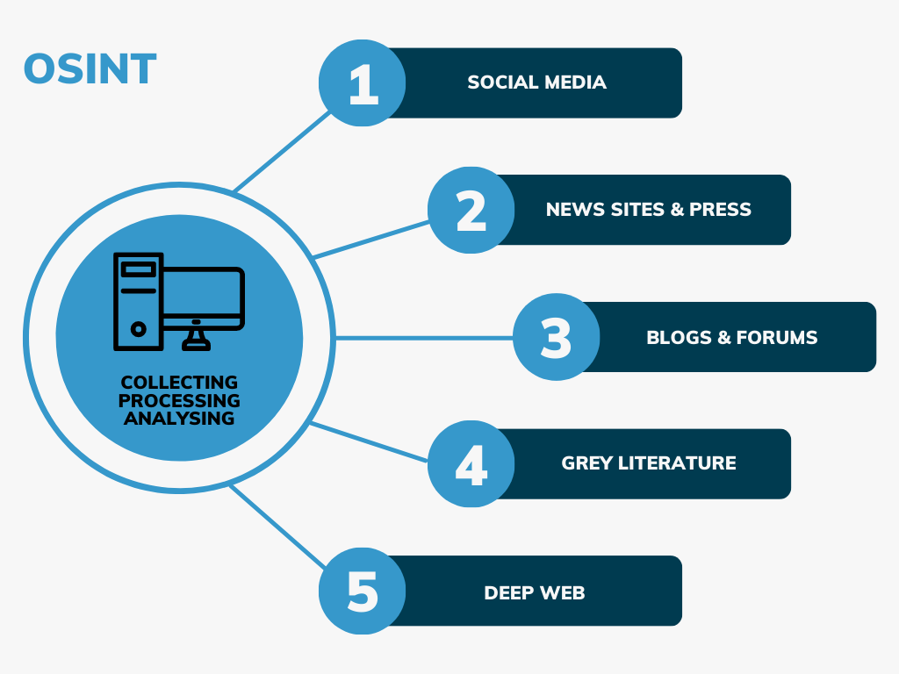

<!-- _class: lead -->
<!-- _paginate: false -->

# Connaître les techniques de hacking et les contre-mesures

---

## Sommaire

#### Introduction au Hacking Éthique
   - **Concepts de base**
   - **Cadre juridique et éthique**

#### Techniques de Hacking
   - **Reconnaissance (Reconnaissance)**
   - **Scanning et énumération**
   - **Exploitation des vulnérabilités** 
   - **Maintien de l'accès**
   - **Escalade de privilèges**
   - **Couverture des traces**

--- 

## Sommaire

#### Contre-mesures
   - **Reconnaissance et détection**
   - **Renforcement des systèmes et des réseaux**
   - **Protection contre les exploits**
   - **Contrôle d'accès et gestion des privilèges**
   - **Cryptographie et sécurisation des communications**
   - **Plan de réponse aux incidents**
   - **Formation et sensibilisation des utilisateurs**

---

<!-- _class: lead -->
<!-- _paginate: false -->

## Introduction au Hacking Éthique

---

## Introduction au Hacking Éthique

**Concepts de base**

- Le **hacking éthique**, également appelé piratage éthique ou test d’intrusion, désigne la pratique consistant à pénétrer des systèmes informatiques, des réseaux ou des applications avec l'autorisation des propriétaires dans le but de découvrir des vulnérabilités que des hackers malveillants pourraient exploiter. 
- Cette pratique est effectuée par des professionnels qualifiés appelés hackers éthiques ou pentesteurs, qui utilisent les mêmes techniques et outils que les cybercriminels, mais de manière légale et constructive pour améliorer la sécurité des systèmes.

 
--- 

## Introduction au Hacking Éthique

**Concepts de base**
 

**Le hacking éthique est crucial pour renforcer la sécurité informatique. Il aide les organisations à :**

1. **Identifier et corriger les failles de sécurité** avant qu'elles ne soient exploitées.
2. **Évaluer l'efficacité des mesures de sécurité** en place, y compris les politiques de sécurité, l'accès aux points de contrôle, et les mécanismes de défense.
3. **Respecter les réglementations et normes de sécurité** qui requièrent des audits de sécurité réguliers, comme le GDPR, HIPAA, et PCI DSS.
4. **Sensibiliser et former** les équipes de sécurité et de développement sur les meilleures pratiques de sécurité et les dernières techniques de piratage.

---
## Introduction au Hacking Éthique

**Concepts de base**
 

La différence fondamentale entre le hacking éthique et le hacking malveillant réside dans l'intention, la permission et l'impact de l'activité sur les systèmes ciblés.

1. **Intention**:
   - **Hacking éthique** : L'intention est de renforcer la sécurité. Les hackers éthiques cherchent à identifier et à réparer les vulnérabilités pour prévenir des attaques malveillantes. Leur but est bénéfique et vise à améliorer la situation.
   - **Hacking malveillant** : L'intention est de causer du tort, d'exploiter les failles à des fins personnelles ou criminelles, comme le vol de données, la perturbation des services, ou le gain financier.

---
## Introduction au Hacking Éthique

**Concepts de base**

2. **Permission**:
   - **Hacking éthique** : Il est toujours réalisé avec la permission explicite des propriétaires des systèmes informatiques. Cette permission est souvent formalisée par un contrat ou un accord légal définissant le cadre de l'action.
   - **Hacking malveillant** : Il est effectué sans consentement, violant ainsi les lois et les politiques de confidentialité. Cela constitue une intrusion illégale dans les systèmes d'autrui.

---

## Introduction au Hacking Éthique

**Concepts de base**
 

3. **Méthodologie**:
   - **Hacking éthique** : Les méthodes utilisées sont structurées et documentées. Les hackers éthiques suivent des lignes directrices éthiques strictes et s'assurent que leur travail est transparent et réversible. Ils rapportent toutes les vulnérabilités trouvées aux propriétaires et conseillent souvent sur les moyens de les réparer.
   - 
   - **Hacking malveillant** : Les techniques peuvent être destructrices et visent souvent à masquer les traces de l'intrusion. Les hackers malveillants utilisent leurs compétences pour exploiter les failles sans en informer les victimes, et souvent en laissant des backdoors pour faciliter l'accès futur.

---
## Introduction au Hacking Éthique

**Concepts de base**
 

4. **Impact**:
   - **Hacking éthique** : L'impact est positif, car il conduit à une meilleure sécurité et à une plus grande sensibilisation aux vulnérabilités et aux risques de sécurité.
   - 
   - **Hacking malveillant** : L'impact est négatif, entraînant des pertes financières, des dommages à la réputation, la perte de données sensibles, et d'autres conséquences dommageables pour les victimes.

---

## Introduction au Hacking Éthique

**Cadre juridique et éthique**
 

La législation relative à la sécurité informatique varie considérablement d'un pays à l'autre, mais elle couvre généralement plusieurs aspects fondamentaux pour protéger les données et les systèmes informatiques contre les menaces de sécurité.

---
## Introduction au Hacking Éthique

**Cadre juridique et éthique**
 

### 1. **Union européenne (UE) - Règlement général sur la protection des données (RGPD)**
   - **Objectif** : Protéger les données personnelles des citoyens de l'UE.
   - **Implications** : Impose des exigences strictes sur la collecte, le stockage et la gestion des données personnelles, y compris la nécessité d'obtenir un consentement explicite, le droit à l'oubli, et des notifications obligatoires en cas de violation de données.

---
## Introduction au Hacking Éthique

**Cadre juridique et éthique**
 

#### 2. **États-Unis - Health Insurance Portability and Accountability Act (HIPAA)**

   - **Objectif** : Protéger les informations médicales privées.
   - **Implications** : Définit comment les informations de santé personnelles doivent être protégées, y compris des exigences pour les mesures de sécurité physiques, administratives et techniques.

---

## Introduction au Hacking Éthique

**Cadre juridique et éthique**
 

### 3. **États-Unis et UE - Privacy Shield Framework**
   - **Objectif** : Faciliter le transfert transatlantique de données personnelles entre l'UE et les États-Unis dans le respect de la protection de la vie privée.
   - **Implications** : Fournit un mécanisme pour les entreprises américaines pour se conformer aux exigences de protection des données de l'UE.

---

## Introduction au Hacking Éthique

**Cadre juridique et éthique**
 

### 4. **États-Unis - Children’s Online Privacy Protection Act (COPPA)**
   - **Objectif** : Protéger les enfants de moins de 13 ans lorsqu'ils utilisent des services en ligne.
   - **Implications** : Exige que les sites web et services en ligne dirigés vers les enfants obtiennent le consentement parental avant de collecter des informations personnelles des enfants.

---

## Introduction au Hacking Éthique

**Cadre juridique et éthique**
 

### 5. **International - Payment Card Industry Data Security Standard (PCI DSS)**
   - **Objectif** : Protéger les données des titulaires de cartes de crédit.
   - **Implications** : Établit des normes de sécurité opérationnelle pour tous les membres, marchands et prestataires de services qui stockent, traitent ou transmettent des informations de titulaire de carte.

---

## Introduction au Hacking Éthique

**Rôle et responsabilité des hackers éthiques**
 

- Les hackers éthiques jouent un rôle crucial dans la protection des systèmes informatiques contre les attaques malveillantes. 
- Leur travail consiste à tester de manière proactive la sécurité des systèmes pour identifier et corriger les vulnérabilités avant qu'elles ne soient exploitées par des acteurs malveillants.

---

## Introduction au Hacking Éthique

**Rôles des hackers éthiques**
 

1. **Évaluation de la sécurité** : Réaliser des tests d'intrusion et des audits de sécurité pour évaluer la robustesse des systèmes, des réseaux, des applications web et mobiles contre les tentatives d'intrusion.

2. **Identification des vulnérabilités** : Utiliser des méthodes et outils avancés pour découvrir les failles de sécurité dans les infrastructures informatiques, y compris les failles logicielles, les configurations erronées, et les pratiques inadéquates de gestion des données.

3. **Rapport détaillé** : Fournir des rapports détaillés sur les vulnérabilités détectées, leur niveau de risque, et les méthodes d'exploitation potentielles. Ceux-ci incluent également des recommandations pratiques pour sécuriser les systèmes.

4. **Validation des correctifs** : Après que les vulnérabilités identifiées ont été corrigées par les équipes de TI, réaliser une nouvelle série de tests pour s'assurer que les correctifs sont efficaces et ne créent pas de nouvelles failles.

5. **Formation et sensibilisation** : Éduquer les développeurs, le personnel TI et les utilisateurs finaux sur les meilleures pratiques de sécurité, les nouvelles menaces et comment se protéger contre les attaques.

---

## Introduction au Hacking Éthique

**Responsabilités des hackers éthique**
 

1. **Confidentialité** : Maintenir la confidentialité des informations découvertes lors des tests. Les hackers éthiques ne doivent pas divulguer ou utiliser ces informations à des fins personnelles ou non autorisées.

2. **Intégrité** : Agir avec intégrité en évitant d'endommager les systèmes cibles ou de perturber leurs opérations normales lors des tests.

3. **Légalité** : Opérer toujours dans les limites de la loi, avec la permission explicite des propriétaires des systèmes. Ils doivent suivre un cadre légal strict pour éviter les implications juridiques pour eux-mêmes et pour les organisations pour lesquelles ils travaillent.

4. **Rapport responsable** : S'assurer que les vulnérabilités sont rapportées aux bonnes parties prenantes de manière sécurisée pour éviter toute fuite d'informations qui pourrait bénéficier à des hackers malveillants.

5. **Mise à jour continue** : Restez à jour avec les dernières tendances en matière de cybersécurité, les techniques de hacking et les technologies de défense pour rester efficaces dans leur rôle.

---

<!-- _class: lead -->
<!-- _paginate: false -->

##  Techniques de Hacking

---

## Techniques de Hacking
#### Pentesting
 

Les techniques de hacking dans le cadre de tests d'intrusion (pentest) suivent une structure assez standardisée.

 

- **Reconnaissance (Reconnaissance)**
- **Scanning (Balayage)**
- **Gaining Access (Obtenir l'accès)**
- **Maintaining Access (Maintien de l'accès)**
- **Exploitation**
- **Covering Tracks (Effacement de traces)**

---
## Techniques de Hacking
#### Pentesting

1. **Reconnaissance (Reconnaissance)**

   - **Objectif :** Recueillir des informations sur la cible pour préparer les étapes suivantes.
   - **Techniques :** Recherche d'informations publiques (OSINT), exploration de réseaux sociaux, analyse de sites web, reconnaissance passive (sans interaction directe avec la cible) et reconnaissance active (balayage de réseau).

2. **Scanning (Balayage)**

   - **Objectif :** Identifier les vulnérabilités et les points d'entrée potentiels dans le système cible.
   - **Techniques :** Scan de ports (pour identifier les services ouverts), scan de vulnérabilités (pour identifier les failles de sécurité), analyse de services (pour comprendre quels services sont en cours d'exécution et leurs versions), et identification des systèmes d'exploitation.

---
## Techniques de Hacking
#### Pentesting

3. **Gaining Access (Obtenir l'accès)**

   - **Objectif :** Exploiter les vulnérabilités identifiées pour accéder au système cible.
   - **Techniques :** Utilisation d'exploits, attaques par injection SQL, attaques par force brute, attaques par phishing, exploitation de failles logicielles.

4. **Maintaining Access (Maintien de l'accès)**

   - **Objectif :** Installer des moyens pour maintenir l'accès au système même après la détection ou la correction des failles initiales.
   - **Techniques :** Installation de portes dérobées (backdoors), création de comptes utilisateurs, modification de configurations système, installation de rootkits.

---
## Techniques de Hacking
#### Pentesting

5. **Exploitation**

   -  **Objectif :** Réaliser les objectifs de l'attaque tels que le vol de données, la compromission de systèmes supplémentaires ou la perturbation des services.
   - **Techniques :** Escalade de privilèges, extraction de données sensibles, exécution de commandes à distance, déplacement latéral pour compromettre d'autres parties du réseau.

6. **Covering Tracks (Effacement de traces)**

   - **Objectif :** Effacer les traces de l'intrusion pour éviter la détection et les enquêtes post-incident.
   - **Techniques :** Suppression des journaux de connexion, modification des horodatages des fichiers, utilisation de techniques d'obscurcissement, suppression des fichiers temporaires et des logs.

---

## Techniques de Hacking
#### Pentesting 

 

**Documentation :**

 

- **OSSTMM (Open Source Security Testing Methodology Manual) :** Un cadre complet pour les tests de sécurité couvrant divers types de tests (réseaux, applications, humains, etc.).
- **OWASP (Open Web Application Security Project) :** Fournit des guides et des méthodologies spécifiques pour les tests de sécurité des applications web.
- **PTES (Penetration Testing Execution Standard) :** Un standard pour l'exécution de tests d'intrusion, décrivant les phases de planification, de reconnaissance, de balayage, d'exploitation, de post-exploitation et de reporting.
- **NIST SP 800-115 :** Un guide du National Institute of Standards and Technology pour la conduite des tests techniques de sécurité.

---

## Techniques de Hacking
#### Les techniques d'attaques par catégorie 

 

**1. Techniques de Reconnaissance :**

   - **Footprinting :** Collecte d'informations sur la cible à partir de sources publiques.
   - **Whois :** Recherche d'informations sur l'enregistrement de domaines.
   - **Reconnaissance DNS :** Extraction d'informations à partir de serveurs DNS.
   - **Social Engineering :** Manipulation des personnes pour obtenir des informations sensibles.

 

**2. Techniques de Scanning :**
   - **Port Scanning :** Identification des ports ouverts sur un réseau ou un système.
   - **Vulnerability Scanning :** Utilisation d'outils pour identifier les vulnérabilités dans les systèmes et les applications.
   - **Network Mapping :** Création d'une carte des appareils et des services sur un réseau.

---

## Techniques de Hacking
#### Les techniques d'attaques par catégorie 
 

**3. Techniques d'Exploitation**

 - **Injection SQL :** Insertion de commandes SQL malveillantes dans des requêtes d'application web.
 - **Cross-Site Scripting (XSS) :** Injection de scripts malveillants dans des pages web vues par d'autres utilisateurs.
 - **Buffer Overflow :** Exploitation d'erreurs de gestion de mémoire pour exécuter du code malveillant.
 - **Phishing :** Envoi de courriels ou de messages trompeurs pour obtenir des informations sensibles.
 - **Exploits Zero-Day :** Utilisation de vulnérabilités non encore connues du public ou des fournisseurs.

 

**4. Techniques de Maintien de l'Accès**

 - **Backdoors :** Installation de portes dérobées pour un accès ultérieur non autorisé.
 - **Rootkits :** Outils permettant de masquer les processus et les fichiers, rendant l'accès persistant difficile à détecter.

---

## Techniques de Hacking
#### Les techniques d'attaques par catégorie 

 

**5. Techniques de Post-Exploitation**

   - **Privilege Escalation :** Obtention de niveaux de privilèges plus élevés sur un système compromis.
   - **Pivoting :** Utilisation d'un système compromis pour attaquer d'autres systèmes sur le même réseau.
   - **Data Exfiltration :** Vol de données sensibles à partir du système compromis.

 

**6. Techniques d'Effacement de Traces**

   - **Log Cleaning :** Suppression ou modification des journaux de sécurité pour effacer les traces d'activité.
   - **Timestamp Manipulation :** Changement des dates et heures des fichiers pour masquer les actions.
   - **Anti-Forensics :** Techniques pour contrecarrer les efforts d'analyse post-incident, comme l'encryption ou l'obfuscation des données.

---

## Techniques de Hacking
#### Les techniques d'attaques par catégorie 

 

**7. Techniques de Réseaux et de Communications**

- **Sniffing :** Capture et analyse du trafic réseau.
- **Man-in-the-Middle (MITM) :** Interception et altération des communications entre deux parties sans qu'elles le sachent.
- **ARP Spoofing :** Usurpation d'adresses IP pour intercepter le trafic réseau.

---

## Techniques de Hacking
#### Reconnaissance

---

## Techniques de Hacking
#### Reconnaissance

 
L'Open Source Intelligence (OSINT) désigne la collecte et l'analyse d'informations disponibles publiquement à partir de sources ouvertes.

### 1. Recherche sur Internet
- **Moteurs de recherche :** Utilisation de moteurs de recherche comme Google, Bing, ou DuckDuckGo pour trouver des informations.
- **Opérateurs de recherche avancée :** Utilisation d'opérateurs comme site:, filetype:, intext:, intitle:, etc. pour affiner les recherches.
- **Wayback Machine :** Utilisation de l'Internet Archive pour accéder aux versions archivées de pages web.

---
## Techniques de Hacking
#### Reconnaissance

### 2. Réseaux sociaux
- **Profilage :** Analyse des profils et des publications sur des plateformes comme Facebook, Twitter, LinkedIn, Instagram.
- **Graph Search :** Utilisation de fonctionnalités de recherche avancée pour découvrir les relations et les connexions entre les utilisateurs.
- **Sentiment Analysis :** Analyse des sentiments des publications pour obtenir des informations sur les opinions et les attitudes.

---

## Techniques de Hacking
#### Reconnaissance

### 3. Bases de données et registres publics
- **Whois :** Consultation des informations de registre de domaine.
- **Registres d'entreprises :** Accès aux informations sur les entreprises via des registres comme Infogreffe, Companies House, etc.
- **Documents gouvernementaux :** Recherches dans les bases de données gouvernementales, les archives judiciaires, les rapports financiers, etc.

---

## Techniques de Hacking
#### Reconnaissance

### 4. Forums et communautés en ligne
- **Recherche dans les forums :** Participation et surveillance des discussions sur des forums spécialisés comme Reddit, 4chan, etc.
- **Newsgroups :** Utilisation de groupes de discussion comme Google Groups pour trouver des informations spécialisées.

---

## Techniques de Hacking
#### Reconnaissance

### 5. Médias traditionnels et électroniques
- **Articles de presse :** Lecture et analyse d'articles de journaux, de magazines, et de sites d'information.
- **Communiqués de presse :** Surveillance des communiqués de presse pour des informations officielles.

### 6. Analyse de documents
- **Metadata :** Extraction et analyse des métadonnées des documents pour obtenir des informations supplémentaires.
- **OCR (Optical Character Recognition) :** Utilisation de la reconnaissance optique de caractères pour extraire du texte à partir d'images ou de PDF scannés.

---
## Techniques de Hacking
#### Reconnaissance

### 7. Surveillance des réseaux
- **Analyse de trafic :** Surveillance et analyse du trafic réseau pour détecter des informations sensibles.
- **Sniffing :** Utilisation d'outils de sniffing pour capturer et analyser les paquets de données sur un réseau.

### 8. Techniques de géolocalisation
- **Analyse de photos :** Utilisation des métadonnées des photos (EXIF) pour obtenir des informations sur l'emplacement et l'heure de la prise de vue.
- **Google Earth/Maps :** Utilisation des outils de cartographie pour analyser des emplacements et des infrastructures.

---

## Techniques de Hacking
#### Reconnaissance

### 9. Scraping et automatisation
- **Web scraping :** Utilisation d'outils et de scripts pour extraire des informations de sites web de manière automatisée.
- **Bots :** Développement de bots pour automatiser la collecte d'informations sur différentes plateformes.

### 10. Analyse des relations
- **Graphes de liens :** Utilisation de logiciels pour créer des graphes de liens entre des entités (personnes, entreprises, événements) pour visualiser et analyser les relations.

---
## Techniques de Hacking
#### Reconnaissance

- Google hacking :
   https://www.google.com/advanced_search?hl=fr
   https://www.exploit-db.com/google-hacking-database

---

## Techniques de Hacking
#### Reconnaissance

- Autre moteur de recherche : 
   https://www.shodan.io/
   https://tineye.com/

---

## Techniques de Hacking
#### Reconnaissance

- Autre outils reconnaissance : 
   - Spiderfoot
   - nslookup
   - dig
   - Whois
   - ping
   - traceroute

---

## Techniques de Hacking
#### Reconnaissance

- Autre outils reconnaissance : 
   - https://www.iplocation.net
   - https://web.archive.org

---